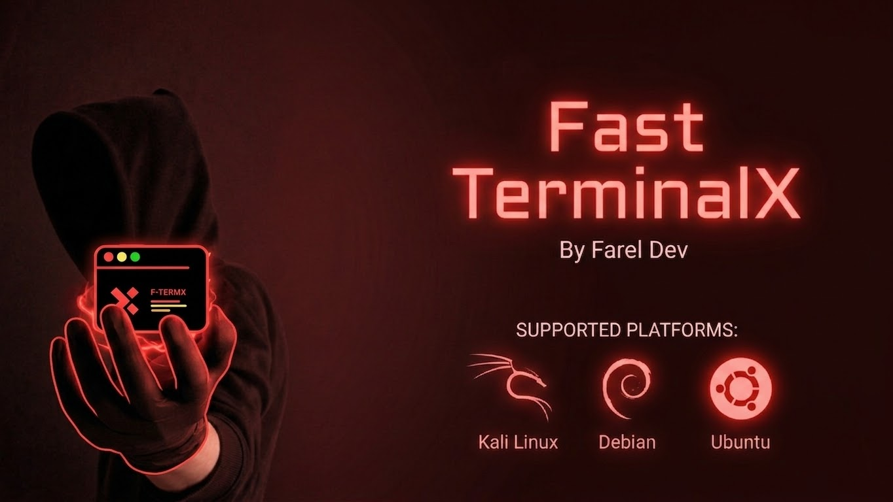

## Information
Fast-TerminalX (abbreviated **Ftermx**) is an SSH tunnel application that runs in the Node.js environment.

Make sure you have met the following requirements before running Ftermx:
- **Nodejs** - **SSH client** and **npm** installed on your system

## SSH Installation

If SSH is not yet installed, run the following command:

```bash
sudo apt install openssh-client
```

> *Note:* The above command is for Debian/Ubuntu-based Linux distributions. For other operating systems, adjust according to your respective package manager.

## Ftermx Installation

Install Ftermx globally using npm:
```bash
npm install -g f-termx
```

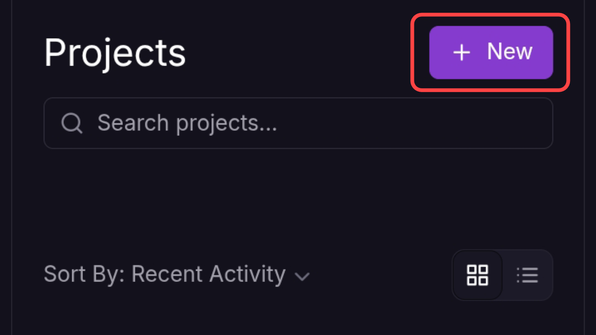

After installation is complete, run the command:
```bash
ftermx
```
The display will look like this
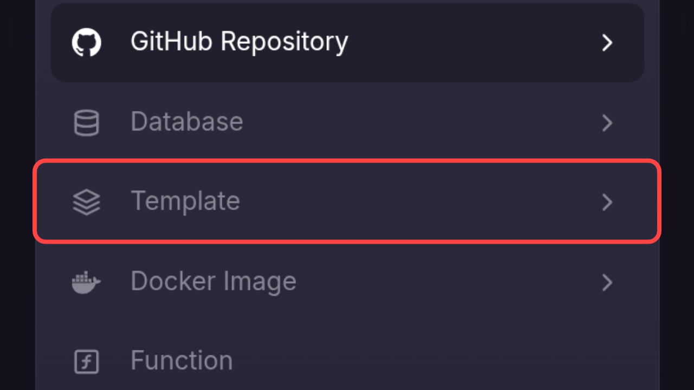

To start Ftermx, type the command:
```bash
ftermx start
```

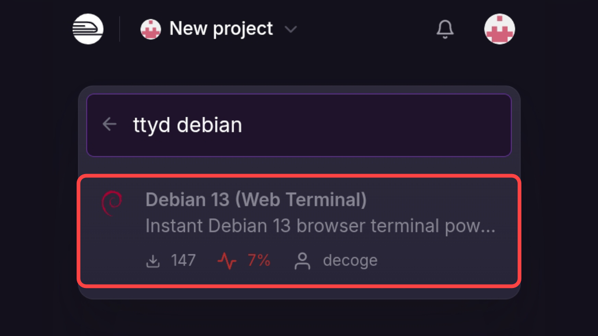
Select one of the available options:
- `local`
- `ngrok`

To select, use the up/down arrow keys on your keyboard

Once done, enter the port (make sure to use a port that is not currently running on your computer)
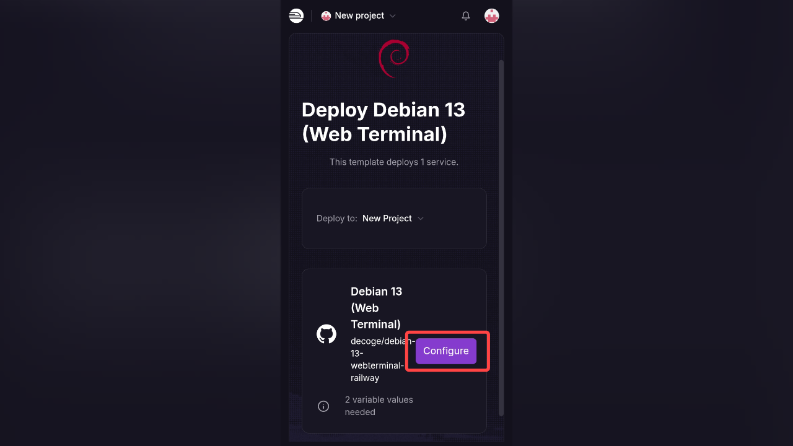

When finished, the result will look like the following image:
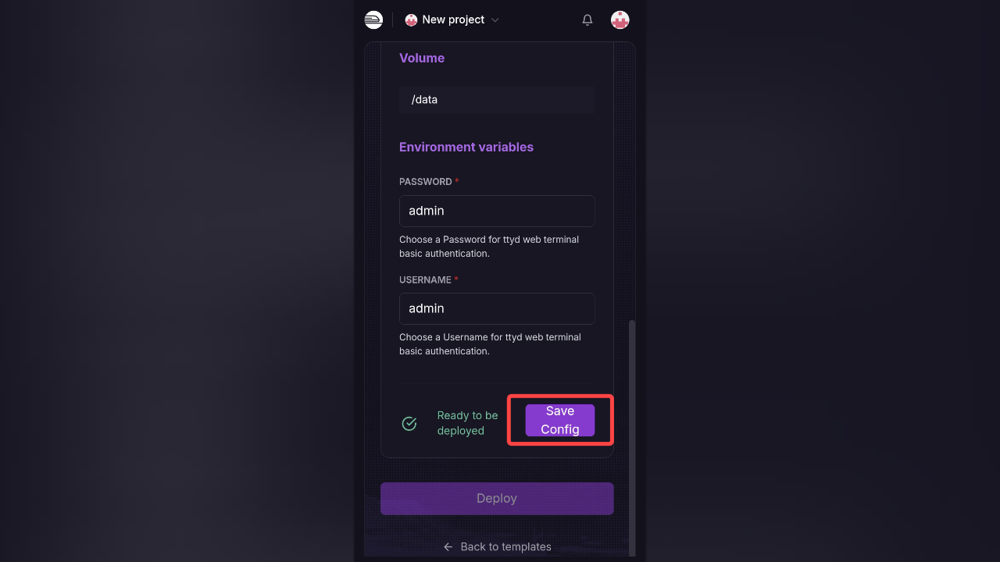

To run the server, open a browser tab and enter your localhost address in the browser search bar, for example:

```bash
localhost:1010
```
The number **1010** should match the port number you entered.

Need help? Type:
```bash
ftermx -help
```

## Admin Access
We provide an admin panel in this tool.

Example command to add a user:
```bash
ftermx add user
```
After that, fill in the requested configuration, or go to the Admin Panel page and add users as needed.

## Ftermx Pages
When you first enter the website, you must log in first:
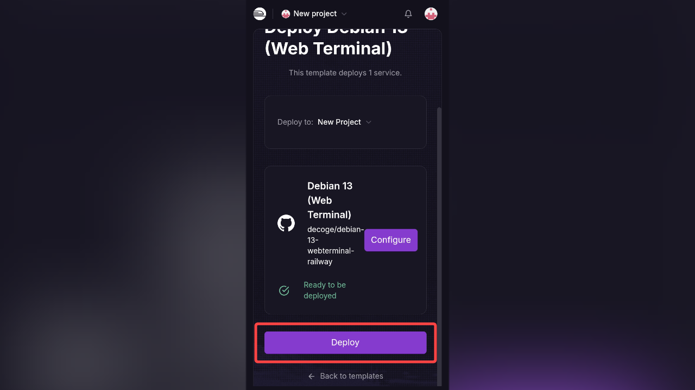

If you haven't added a user to ftermx, fill in with the following information:

Username: 
```bash
admin
```
Password:
```bash
admin
```

## Ftermx Page Documentation
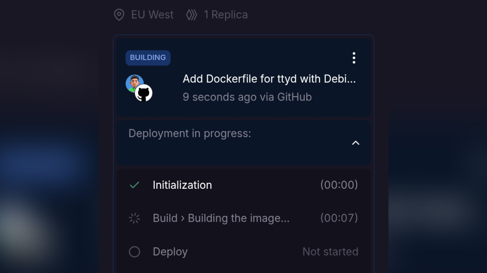

**Terminal Access**
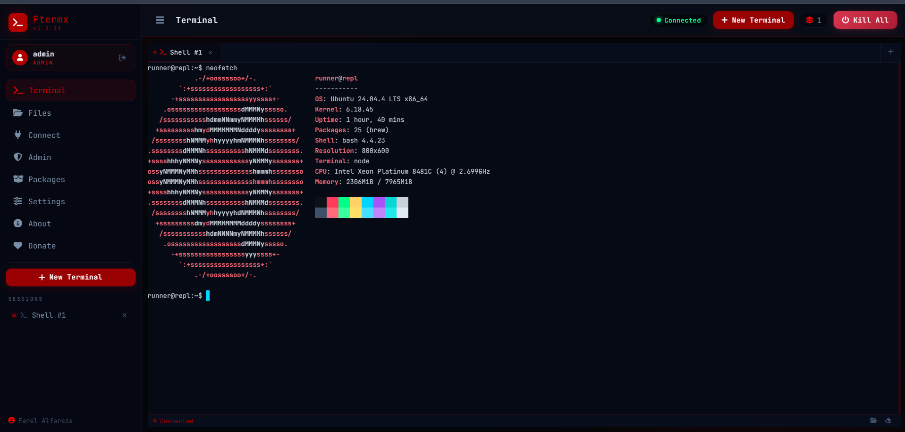

**Install Desired Packages**
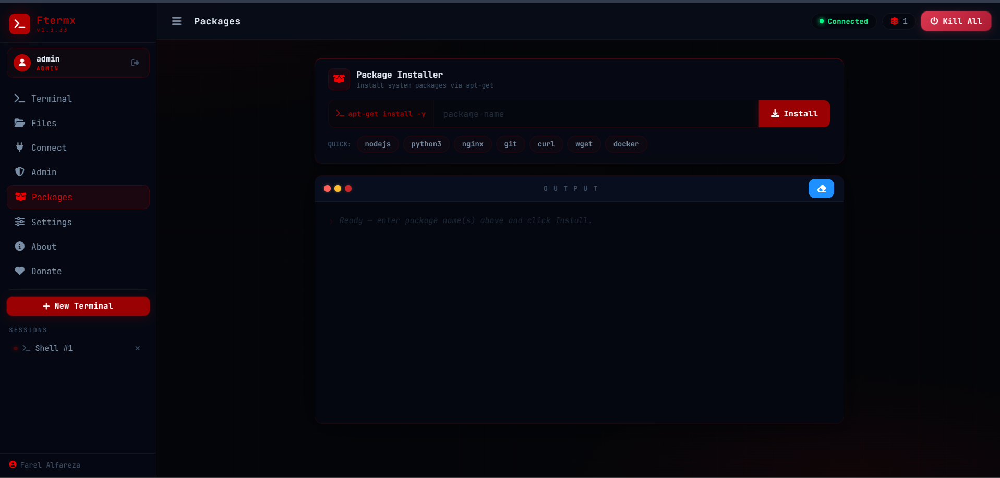

**Admin Panel**
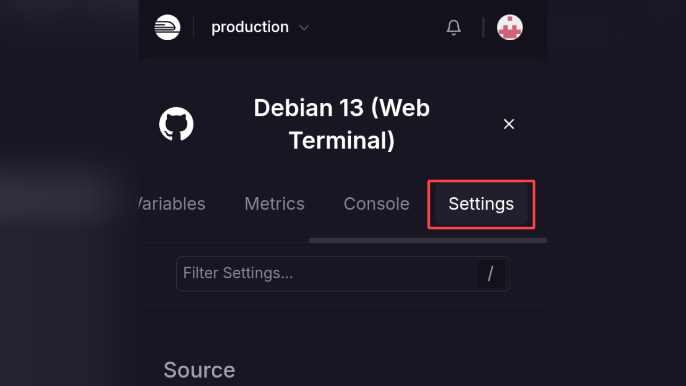

**File Manager**
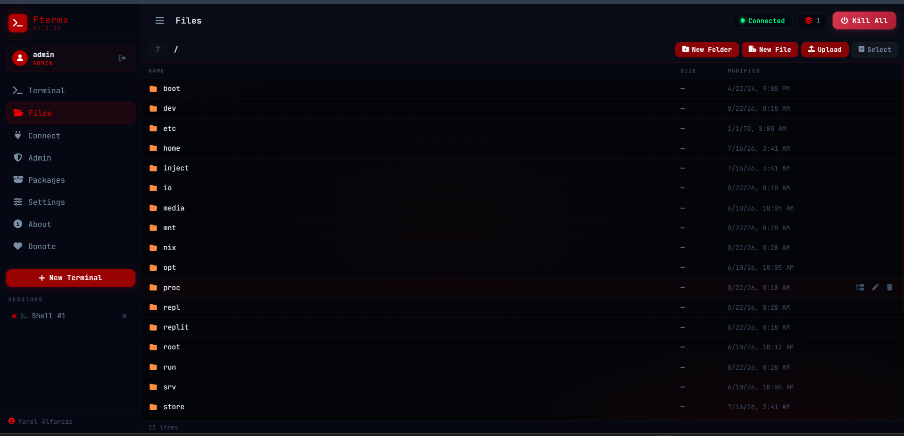

**Information**

 

**License**
[Apache License 2.0](LICENSE)

---

*Made with ❤️ by FarelDev*

<a href="https://saweria.co/farelalfareza">
  
</a>

<a href="https://farelsite.pages.dev">
  
</a>

<a href="https://trakteer.id/farel_alfarez">
  
</a>