<div align="center">


# Fast-TerminalX (Ftermx)

**SSH Tunnel Application Built with Node.js**

[](https://www.npmjs.com/package/f-termx)
[](https://www.npmjs.com/package/f-termx)
[](https://www.npmjs.com/package/f-termx)
[](LICENSE)

[](https://nodejs.org/)

</div>

---

Fast-Terminalx (or ftermx) is a terminal tool for Node.js-based server tunneling.

You can use Railway for the installation:
Railway is a versatile cloud platform and Platform as a Service (PaaS) that allows developers to quickly deploy web applications, servers, databases, and other full-stack services without having to manually manage infrastructure.

## Workflow


Here is how to get a free 30-day VPS on Railway and connect it to ftermx:

First, ensure you have a Railway account; you can log in by visiting https://railway.com. Once you are on the Railway dashboard, click the **New** button in the top-right corner.


After that, select the **Template** section.


Perform a search:
```bash
ttyd debian
```
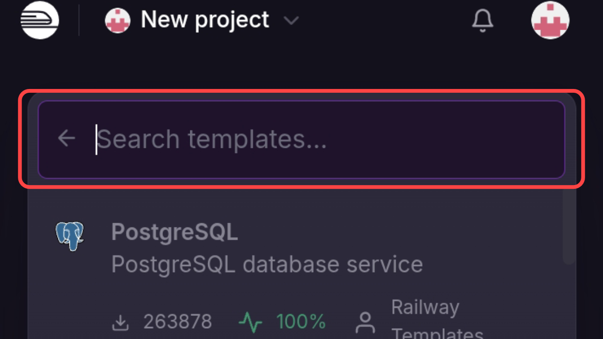
> For the OS, you can use other templates such as Ubuntu, Debian, Kali Linux, Parrot OS, Arch Linux, and so on if available on Railway.

SNext, select the Debian template.


Once you have selected the template, you will be directed to the preview page; configure it first by clicking the "Configure" button.


In the configuration section, the username and password fields are mandatory; once filled in, save the configuration and click the deploy button.


Once that is complete, we move on to the process stages.


This usually takes quite a long time; wait until the process completes successfully and turns green.


Once the process is complete, the next step is to scroll sideways along the top navigation bar until you find the **settings** button.


Click the settings button, then locate the Networking section to change the link and configure the port.


Once you have obtained the public networking section, the next step is to rename the link to your preference by clicking the button with the pen icon.


Once finished, click the **update** button again; leave the port at the default 8080.

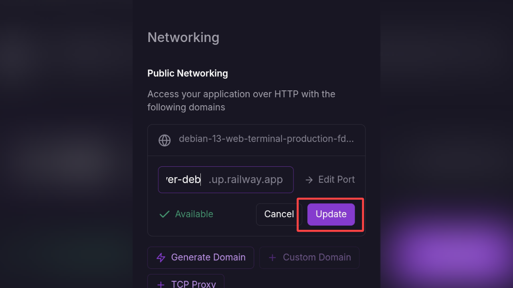

Next, add a new domain for the Ftermx website.

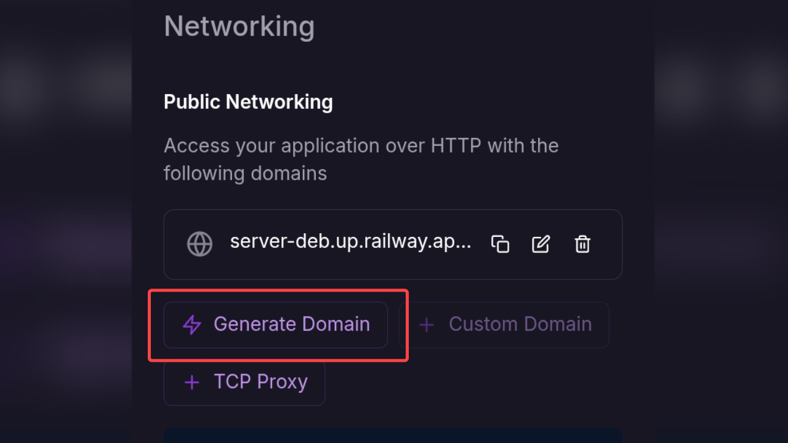

In this section, assign a name for the URL and set the port to 1010; once done, click the **update** button again.

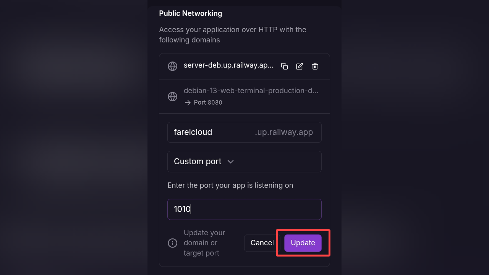

Then, click the URL in the first section.

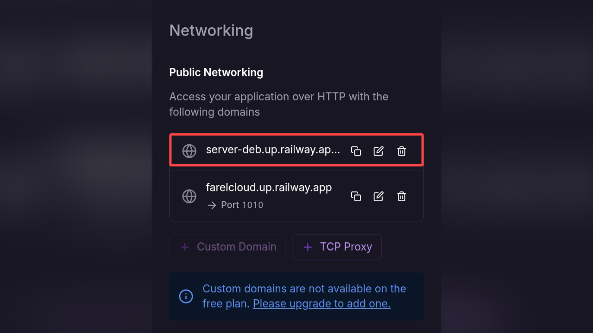

Upon accessing the URL, you will be prompted to enter a username and password; use the credentials you specified during the configuration stage.

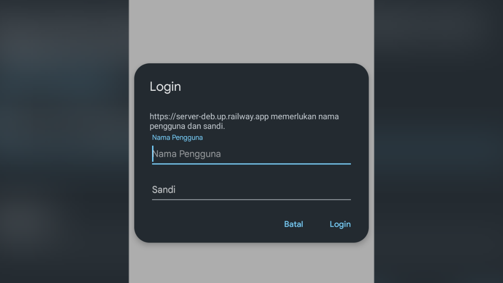

If the display looks like this, you have successfully accessed the VPS terminal; however, since this is just a raw terminal without a UI, *ftermx* is needed to provide a web-based terminal interface.

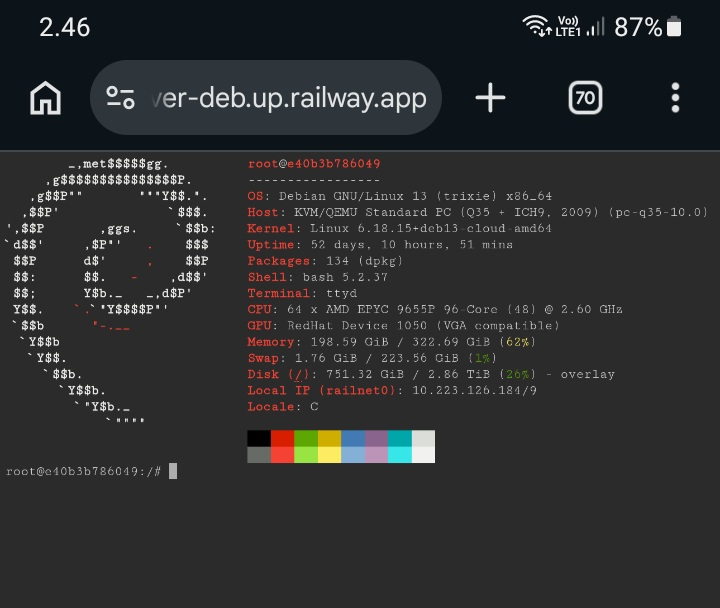

In the terminal, you need to install several packages required to run ftermx; execute all the following commands:

```bash 
apt-get update
```
```bash
apt install tmux
```
```bash
apt install nodejs
```
```bash
apt install npm
```
```bash
apt install openssh
```
Or
```bash
apt install ssh
```

Once all those packages have been installed, the next step is to install ftermx; run the following command:

```bash
npm install -g f-termx
```

Then run the command.
```bash
ftermx
```

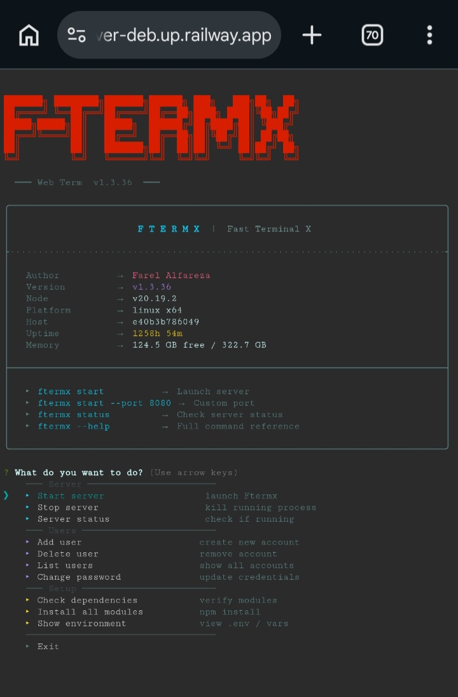

The image above shows the ftermx interface; to run the port, select the **start server** menu option and press Enter.

Alternatively, you can run it directly by typing:

```bash
ftermx start
```
Or
```bash
ftermx start --port 1010
```

Next, press Enter to select either 'local' or 'ngrok' (depending on your needs); using 'local' is recommended, then press Enter.

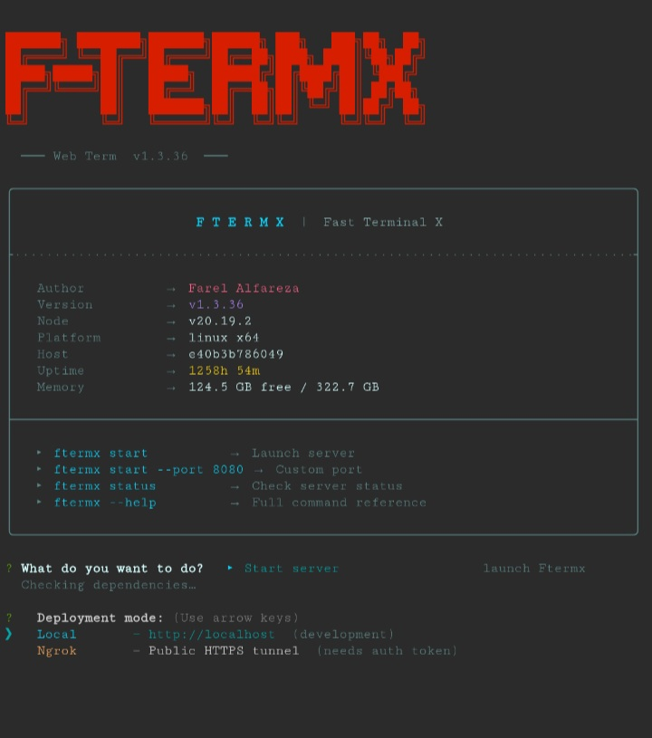

After pressing Enter, the next step is to enter port 1010, matching the port configuration you set up in Railway. Once that is done, return to the Public Networking section of the Railway page and click the second URL to access ftermx.

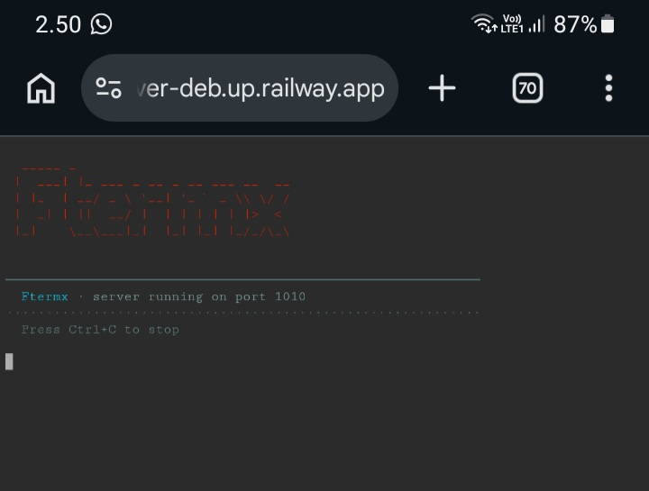

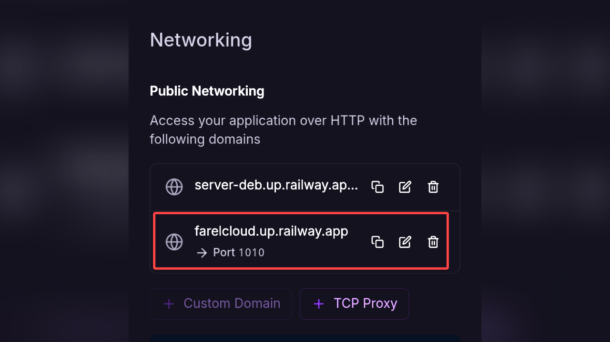

Once the URL has been successfully accessed, you will be redirected to the login page; the default settings are:

Username
```bash
admin
```

Password
```bash
admin
```

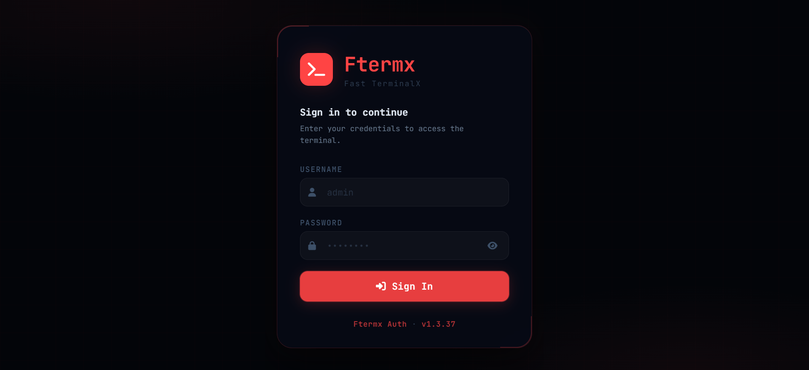

Once the login is successful, you will enter the admin dashboard page.

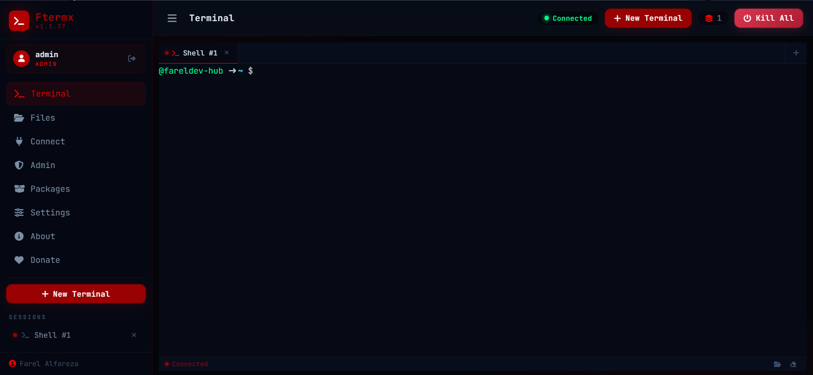

Hopefully, these tools will assist you and simplify your tasks, particularly in managing servers or VPS instances.

Thank you for using ftermx. If you encounter any issues or bugs, please report them to the developers via the links or contact details provided on the fareldev-hub GitHub repository; we are committed to continuously improving ftermx.

## Support

If you find this project useful, consider supporting its development:

[](https://saweria.co/farelalfareza)
[](https://trakteer.id/farel_alfarez)

### Connect

[](https://farelsite.pages.dev)
[](https://github.com/fareldev-hub)

---

<div align="center">
  
**Made with 🤍 by FarelDev**

If you like this project, don't forget to give it a star!

</div>

