# Guide to Connect Fast-terminalX (Ftermx) to Railway

Follow these steps to connect Fast-terminalX (Ftermx) to Railway.

## Prerequisites

Make sure you have:
- An active Railway account
- Termux application installed on your Android device

---

## Step 1: Adding Linux OS on Railway

1. Open your Railway dashboard.
2. Click the **+** button on the dashboard page.

   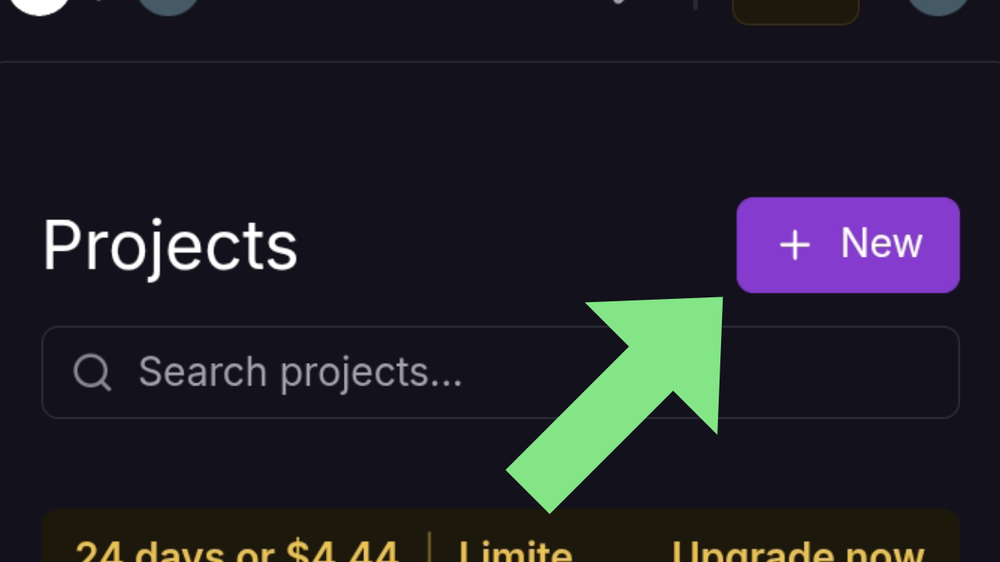

3. Select the **Template** section, then search for:

   ```bash
   ttyd kali linux
   ```

   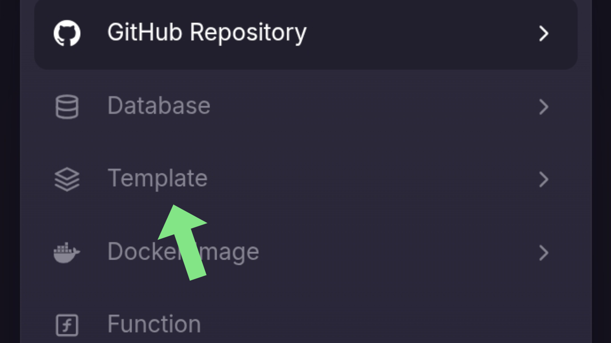
   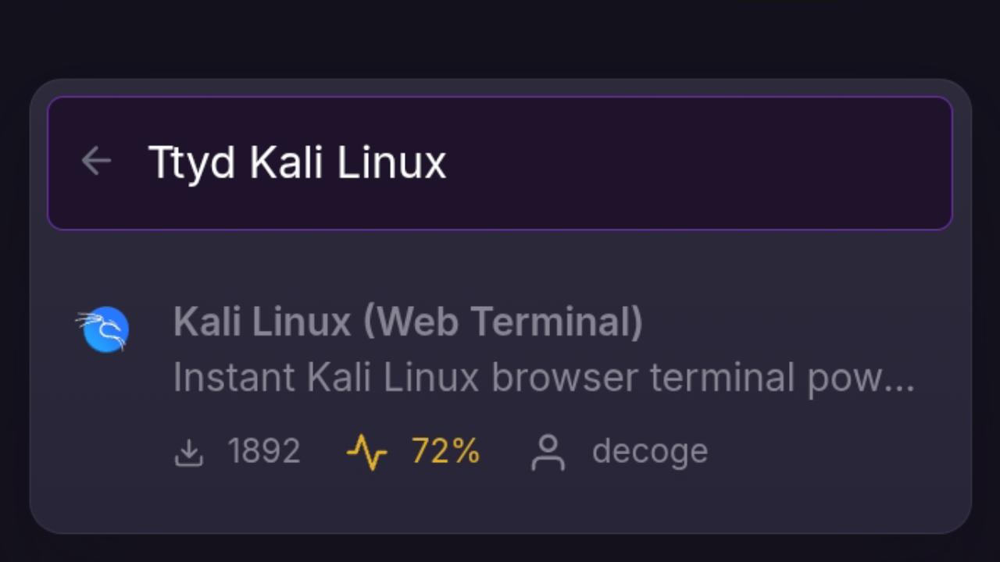

   > You can also use or search for Ubuntu, Debian, or other distributions if available on Railway.

4. Railway will ask for configuration. Click the **"Configure"** button.

   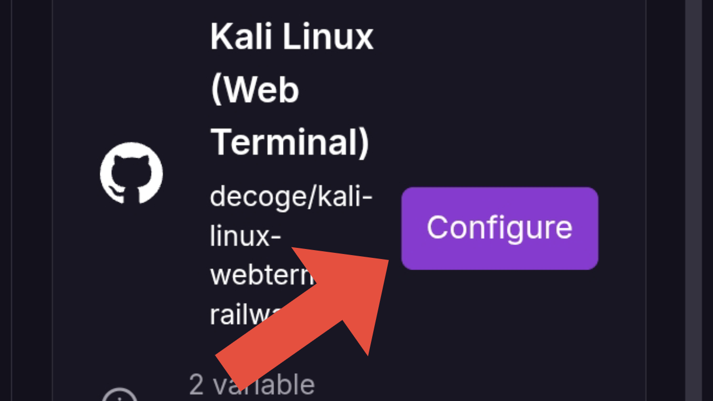

5. Fill in the **Username** and **Password**, then click **Save** and **Deploy**.

   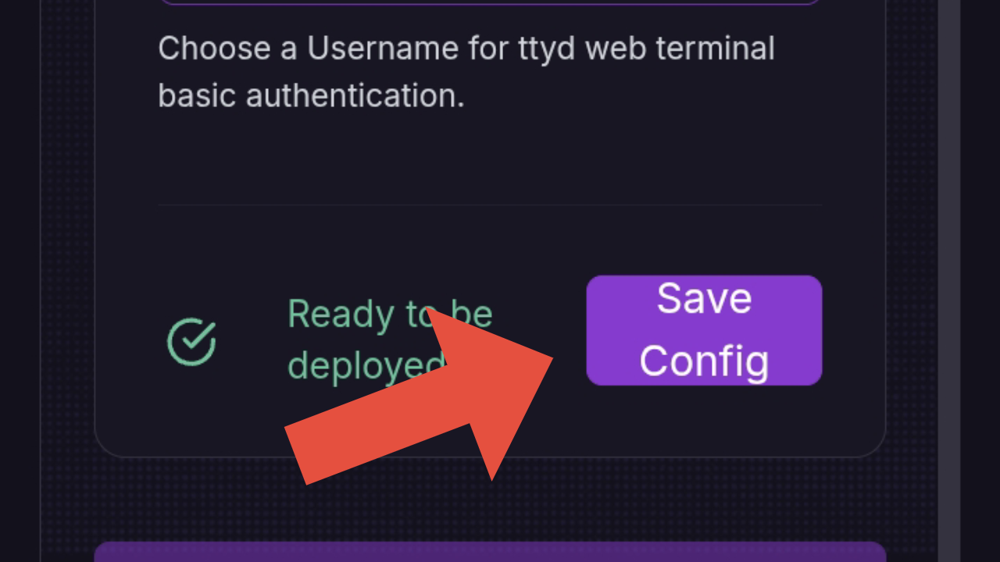
   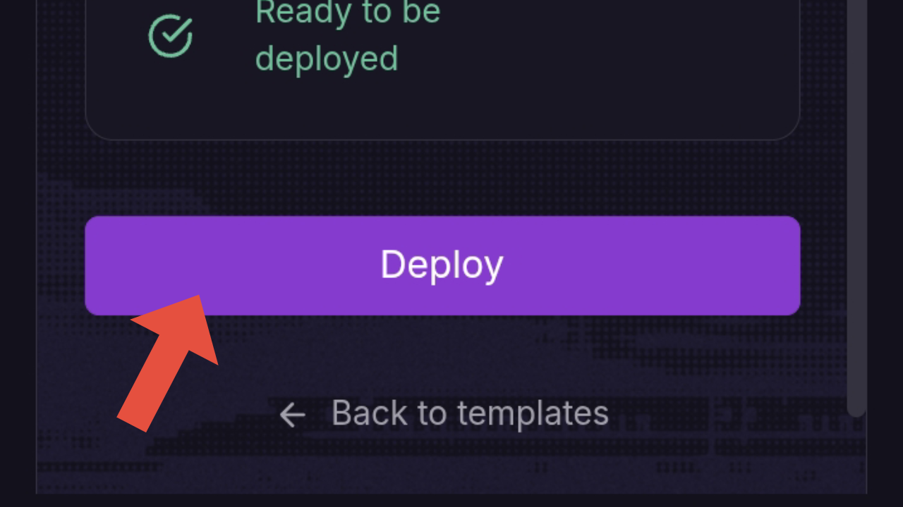

6. Wait for the deployment process to complete. This process may take some time.

---

## Step 2: Networking Configuration

1. After deployment is complete, go to the **Settings** section and find the **Networking** section.

   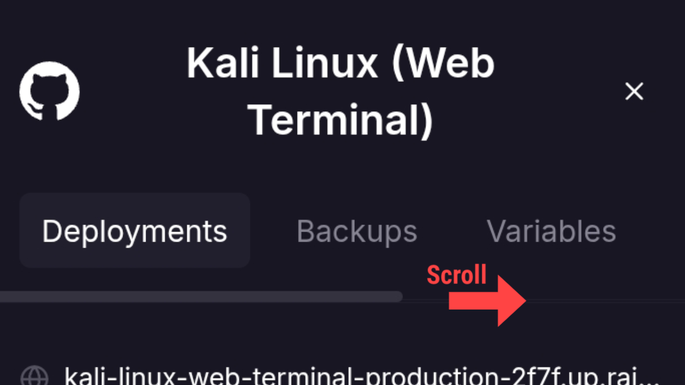

2. Under **Public Networking**, you will see your domain. Click the **Edit** button.

   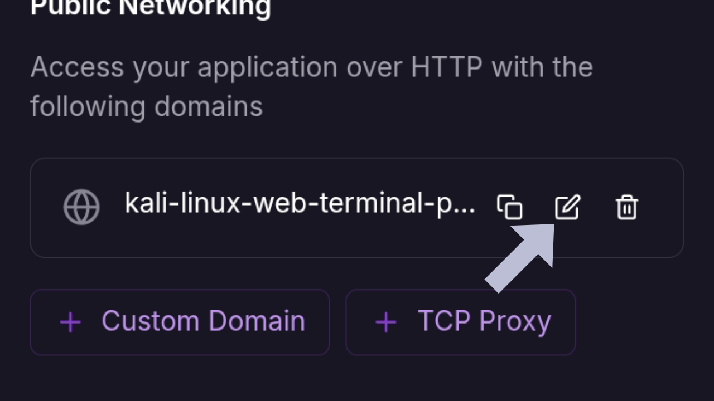

3. **Configuration:**
   - Change the link name as desired
   - Change the port to **1010**

   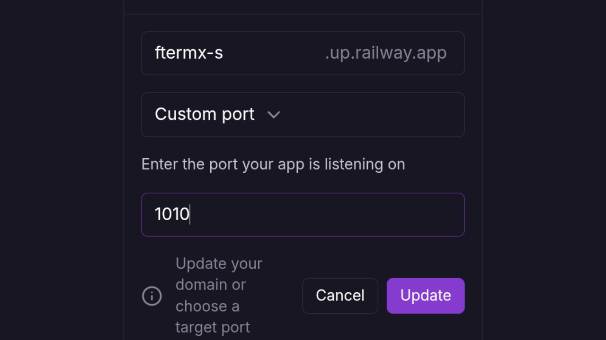

   > Explanation: Ftermx will run on port 1010, so this port must match the Railway configuration.

---

## Step 3: Setting Up Termux

1. Select the **Console** menu and click **"Copy SSH Command"**.

   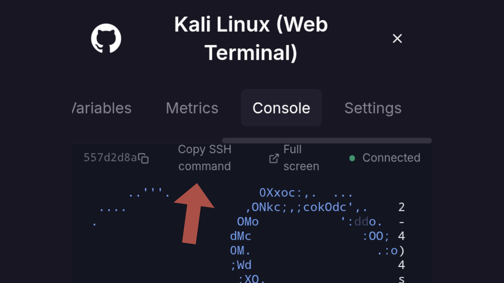

2. Open the Termux application on your phone, then run the following commands:

   ```bash
   pkg update && pkg upgrade
   ```

   ```bash
   pkg install nodejs
   ```

   ```bash
   pkg install npm
   ```

   ```bash
   npm i -g @railway/cli
   ```

   Or using the alternative method:

   ```bash
   bash <(curl -fsSL railway.com/install.sh) -y
   ```

Once you've finished logging in to the railway, use the command:

```bash
railway login
```

Then paste the SSH command from railway into GitHub.

   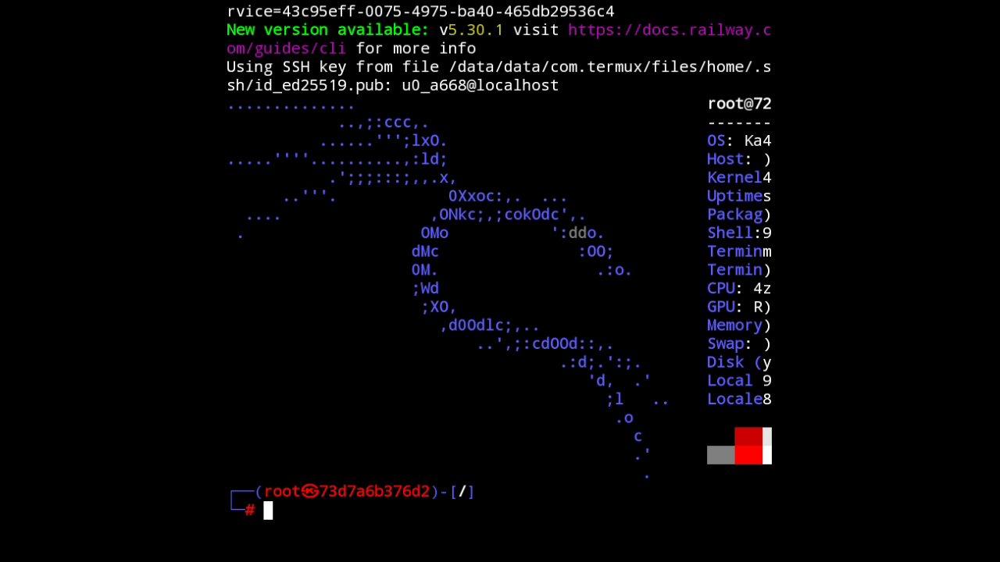

---

## Step 4: Connecting to Railway via SSH

1. Paste the SSH command you copied earlier into the Termux terminal, then press Enter.

   > **Note:** If this is your first time, Railway will guide you to login first. Follow the login process, then re-enter the SSH command if the process exits.

---

## Step 5: Installation in Railway Environment

After logging into the Railway SSH, you need to install **tmux** first:

```bash
apt install tmux
```

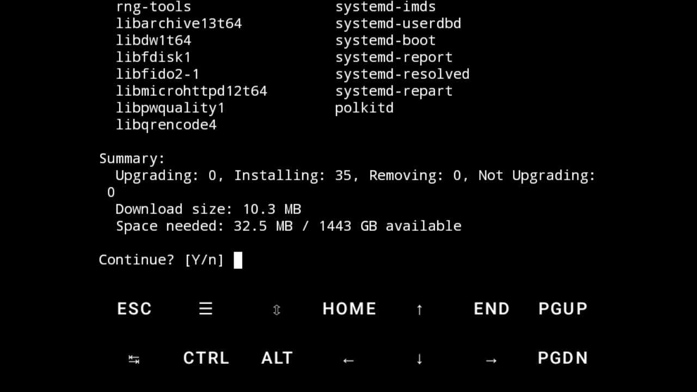

> **Note:** Select **Y** to continue.

Next, install Node.js, npm, and Ftermx:

```bash
apt install nodejs
```

> **Note:** Select **Y** to continue.

```bash
apt install npm
```

> **Note:** Select **Y** to continue.

```bash
npm install -g f-termx
```

---

## Step 6: Running Ftermx with Tmux

1. Create a new tmux session first:

   ```bash
   tmux new -s port1010
   ```

2. Once inside the tmux session, run the command:

   ```bash
   ftermx
   ```

   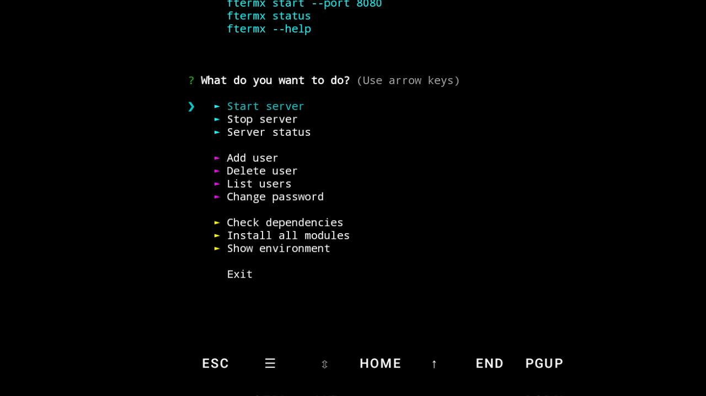

3. To start, select **"start server"** using the arrow keys, then press Enter.

   > **Note:** Use the up/down arrow keys on the Termux keyboard/terminal to select options.

   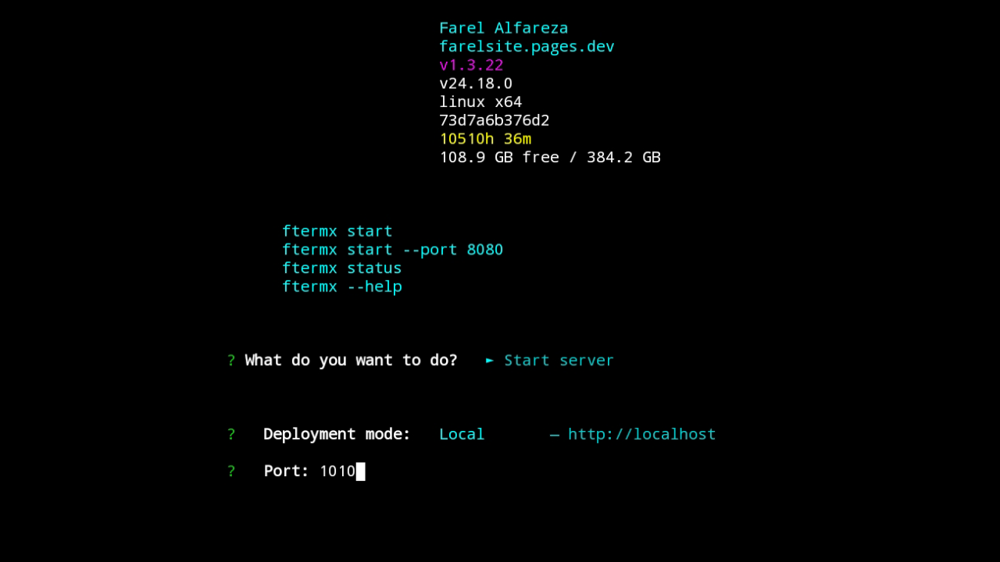

4. For deployment mode, select **"Local"** then press Enter.

5. Enter port **1010** as configured in Railway earlier, then press Enter.

   

---

## Step 7: Accessing Ftermx

1. After completion, return to Railway.
2. Open the link you configured on the **Settings** page.
3. Ftermx is now active and accessible.

   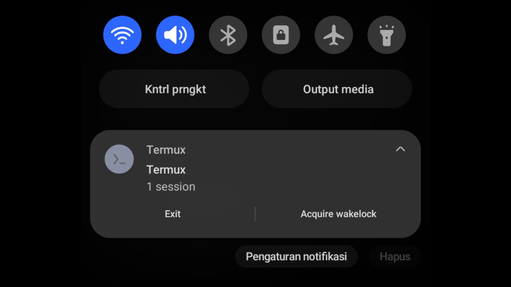

---

## Important Notes

To exit Termux without stopping the server:
- Go to the notification panel, find Termux, and select **"Exit"**.
- **Do not** exit using the `exit` command inside the terminal, as this will stop the running server.

---

## Troubleshooting

| Problem | Solution |
|---------|----------|
| Server not running | Make sure port 1010 is properly configured in Railway and Ftermx |
| Link cannot be accessed | Recheck Public Networking configuration in Railway |
| Error in Termux | Ensure all packages are properly installed (Node.js, npm, Railway CLI) |
| Tmux session disconnected | Use `tmux attach -t port1010` to return to the session |

---

## Command Summary

### Commands in Termux:
```bash
pkg update && pkg upgrade
pkg install nodejs
pkg install npm
npm i -g @railway/cli
```

### Commands in Railway SSH:
```bash
apt install tmux
apt install nodejs
apt install npm
npm install -g f-termx
tmux new -s port1010
ftermx
```

---

By following this guide, your Fast-terminalX (Ftermx) is now connected to Railway and can be accessed from anywhere through a browser.
